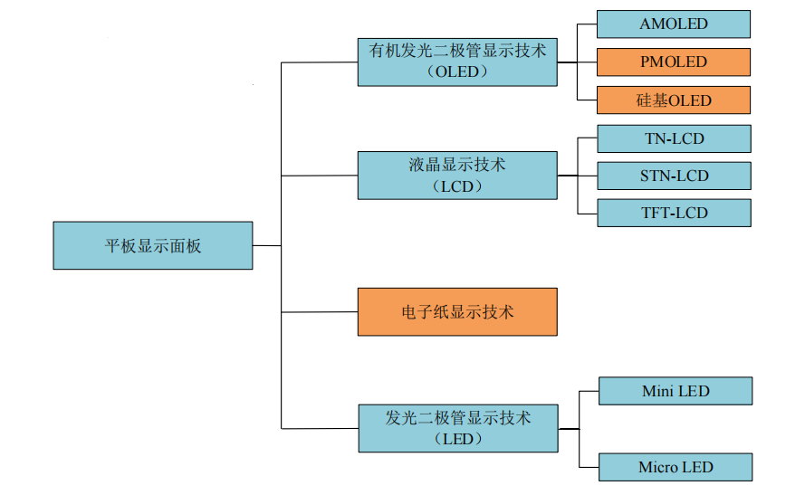
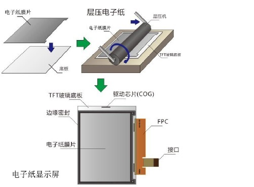
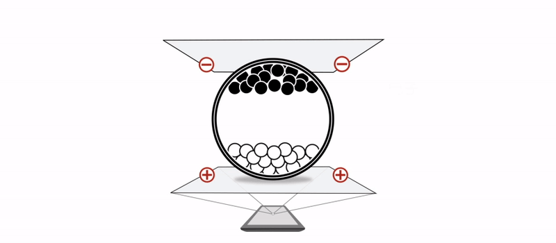
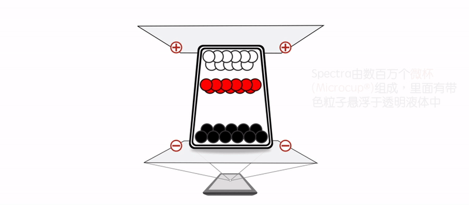
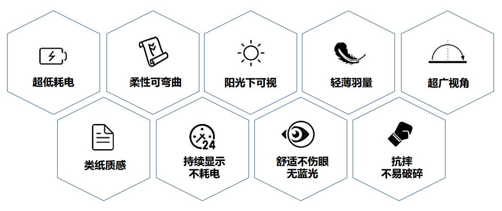
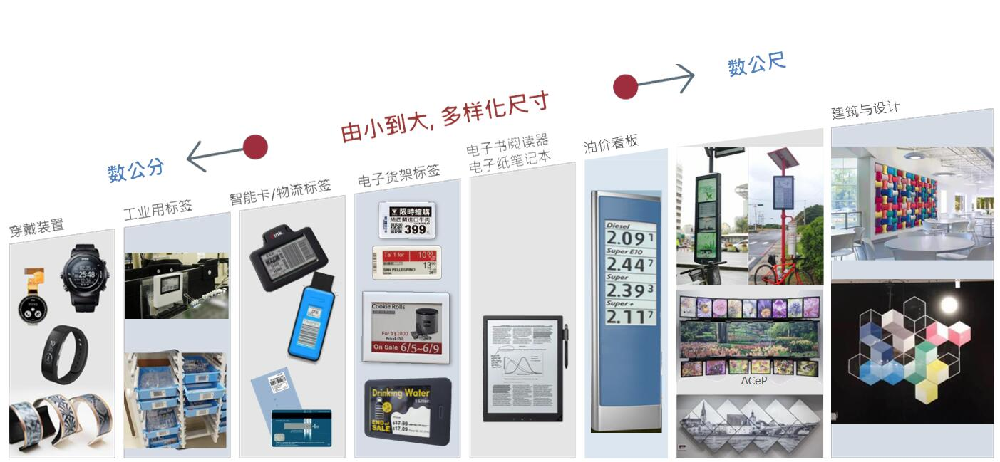

<!-- _coverpage.md -->

# How do I choose the right display module? 

# Display classification

# ePaper (e-ink screen)

## ePaper Module Components
Electronic ink is coated on a layer of plastic film, and then coated with a thin-film transistor (TFT) circuit, controlled by the driver IC, to form pixel graphics, creating electronic paper displays (EPD), also commonly known as ink screens, ink screens, etc., specifically and subtly described as a screen made of ink and like ink.

### Two Particle Ink System
E Ink’s two particle electronic ink system is made up of millions of tiny microcapsules, each about the diameter of a human hair.  Each microcapsule contains negatively charged white particles and positively charged black particles suspended in a clear fluid.  When a positive or negative electric field is applied, corresponding particles move to the top of the microcapsule where they become visible to the viewer.  This makes the surface appear white or black at that spot.

### Three Particle Ink System

The three-color e-ink system works similarly to the two-color system, applying different voltages to cause particles of different colors to move to the upper layer and see different colors. The tri-color system was developed under the Microcup® Eink patent architecture.

## ePaper Module Benefits

### Bi-Stability

No power is needed to hold an image.

E Ink's technology is commonly referred to as "bistable". Bistablility refers to the fact that an image on an E Ink screen will be retained even when all power sources are removed. This means that the display is consuming power only when something is changing. For example, when reading on an eReader, power is only needed when turning to a new page but no power is consumed by the display while reading the page. Bistability significantly reduces the power consumption and is a key reason devices using E Ink have such long battery life. The larger ePaper screen, the more electronic power can be saved compared with the same size LCD screen.

### Reflective

No backlight is used.

E Ink displays are referred to as "reflective displays." In an LCD, or "emissive display", light from a backlight is projected through the display towards your eyes. In an E Ink display, no backlight is used; rather, ambient light from the environment is reflected from the surface of the display back to your eyes. As with any reflective surface, the more ambient light, the brighter the display looks. This attribute mimics traditional ink and paper, and users of E Ink displays have said that they do not have the same eye fatigue as with LCDs when reading for long periods of time. Eliminating the need for a backlight significantly increases the battery life versus using a traditional LCD.

### Rugged

Plastic-based films enable durable displays.

E Ink displays are comprised of an ink layer laminated to a plastic film substrate. Depending on the application, product designers may use a traditional glass-based TFT, or utilize our E Ink Mobius plastic-based TFTs.

Plastic-based TFTs allow the end product to be substantially lighter and thinner than products using glass-based TFTs. In addition, glass-based TFTs can be fragile; use of plastic-based TFTs can result in a more rugged end product with less breakage in the electronics due to drops or stress tension.

A 13.3" E Ink displays with a plastic TFT and similar internal components can weigh only 12.3 ounces (349g) as compared to an LCD-based display with smaller screen size 12.9”, which weighs an average of 25.2 ounces (713g).

E Ink also offers a simple segmented product line, E Ink SURF™. In this product line, a drive line is routed to each segment, making for a conformable, rugged, all plastic display, suitable for simple character- or icon-based displays. 

## E-paper application scenarios

## E-paper selection reference

## Where to buy？

Email： 542165823@qq.com or xden@sina.cn

