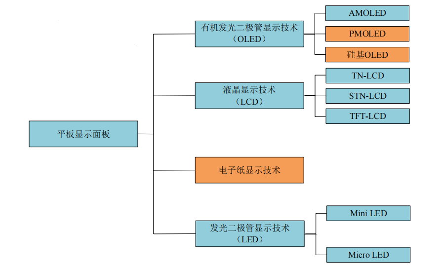
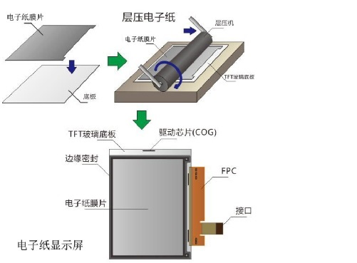
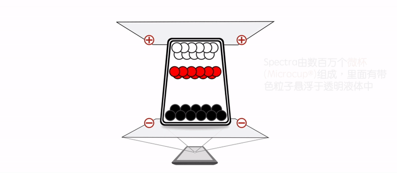
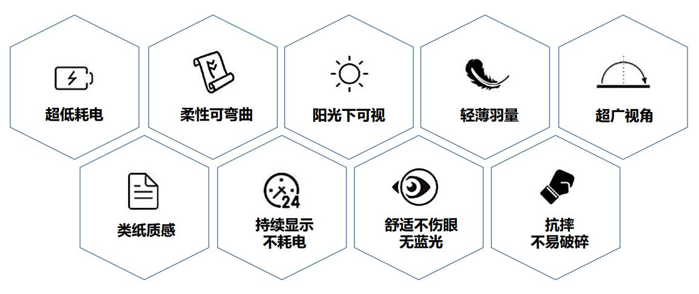
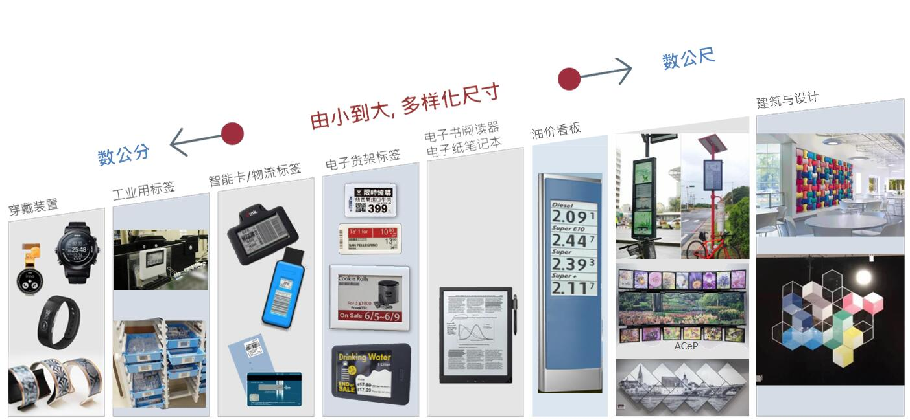
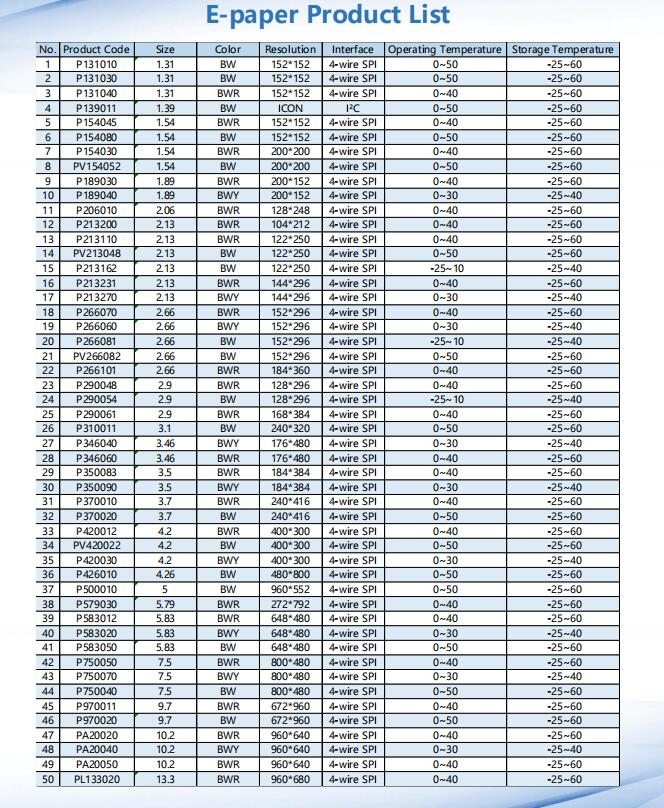

<!-- _coverpage.md -->

# 如何选择一款适合的显示屏？ 

# 显示屏分类

# 电子纸(电子墨水屏)

## 电子纸构成元素
将电子墨水涂布在一层塑料薄膜上，再贴覆上薄膜晶体管(TFT)电路，经由驱动IC控制，形成像素图形，创造了电子纸显示屏(Electronic Paper Displays, EPD)，也常被习称为墨水屏、水墨屏等，具体而微地形容了这是一块用墨水、也像墨水制造出的屏幕。

### 双色电子墨水原理 <!-- {docsify-ignore} -->
每个微胶囊里含有电泳粒子──带负电荷的白色以及带正电荷的黑色粒子，悬浮于透明液体中。利用正负相吸的原理，当电场接通时，该区块对应的黑或白粒子会移动至微胶囊的顶端，使用者在该区块上，就能看见白色或黑色。

### 三色电子墨水原理 <!-- {docsify-ignore} -->

三色电子墨水系统运作原理与双色系统类似，施加不同的电压，使不同颜色的粒子移动至上层，看见不同的颜色。三色系统在微杯技术(Microcup®  Eink专利)架构下开发而成。

## 电子纸特点

### 双稳态(Bi-Stability) <!-- {docsify-ignore} -->

在电源完全移除或断电的状态下，画面仍可持续显示在屏幕上，不会消失。
E Ink的电子纸技术通常被称为「双稳态」(Bi-stable)技术。所谓的双稳态，就是即使移除供电来源，电子纸显示屏上的画面仍然能持续显示，不会消失。仅在更换画面时，才需要消耗电量。
实际应用上，使用电子纸屏幕的电子书在翻页时，才需要消耗电量，在阅读期间则不会消耗任何电量。这正是使用了电子纸作为显示器屏幕，具备长时间待机的原因。
在大型电子看板的应用上，画面不变换的时候，也是完全不需要消耗电量的，长期下来，与相同尺寸的LCD显示屏看板相比之下，拥有非常优异的节电性能。

### 反射式技术(Reflective) <!-- {docsify-ignore} -->

不自发光、没有背光模组
电子纸显示屏也常被称为「反射式显示屏」，完全不需要背光源，是利用环境光源打在电子纸显示屏幕上，再折射光线至观看者的眼中，与传统纸张、或生活中物体的可视原理无异，所以环境光源越亮，电子纸也越清晰可见。
而LCD或OLED等显示屏幕，需有背光模组或自发光，才能看到影像。但背光源或自发光的光线会穿透显示屏幕，直射观看者的眼睛，容易导致视觉疲劳、蓝光引起的黄斑部病变等问题。
不需要背光模组的电子纸显示屏，非常适合长时间阅读，另外，没有背光模组也可节约电力，大幅提升待机时间。

### 可耐久性 <!-- {docsify-ignore} -->****

基于塑料基板的电子墨水薄膜，实现耐用、耐久的显示屏
墨水薄膜本身是柔性的，电子墨水薄膜贴覆至TFT基板上，构成了电子纸显示屏。依据不同的应用需求，产品开发设计人员可能使用一般的玻璃基板，或柔性的塑料基板，使用了柔性基板的电子纸显示屏也就是E Ink Mobius柔性电子纸显示屏。

一片13.3寸塑料基板的柔性电子纸显示屏模组，约等同于15张A4纸张的重量、7张A4纸的厚度。这样的柔性显示屏模组，能让终端产品更轻薄，采用13.3寸柔性电子纸的终端产品，仅重349克(12.3盎司)；而使用12.9寸LCD显示屏的产品，却重达713克(25.2盎司)。

此外，塑料基板比易碎的玻璃基板显示屏来得更为耐久、不易碎裂，终端产品掉落或遭受撞击时，可减少产品的损坏概率。

电子纸与其他显示屏技术最大的不同在于，电子纸是反射式、双稳态的显示技术，所以视觉上看起来与传统纸张几乎没有分别，因此能创造护眼、节能的效益。

## 电子纸应用场景

## 电子纸选型参考

## 哪里购买？

@需要样品及报价可邮箱联系 542165823@qq.com

